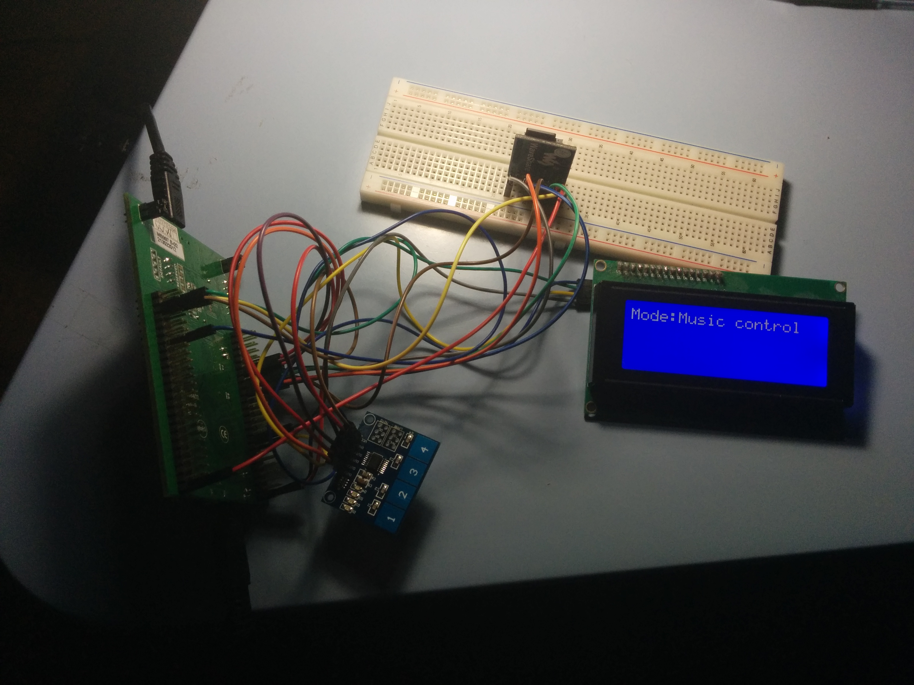
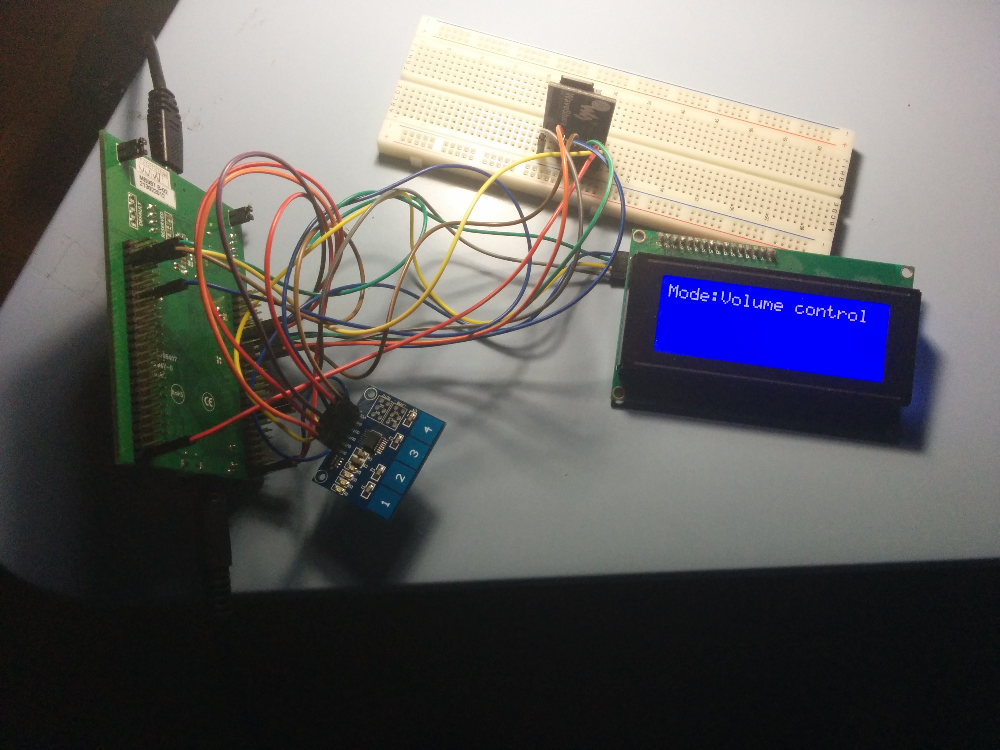
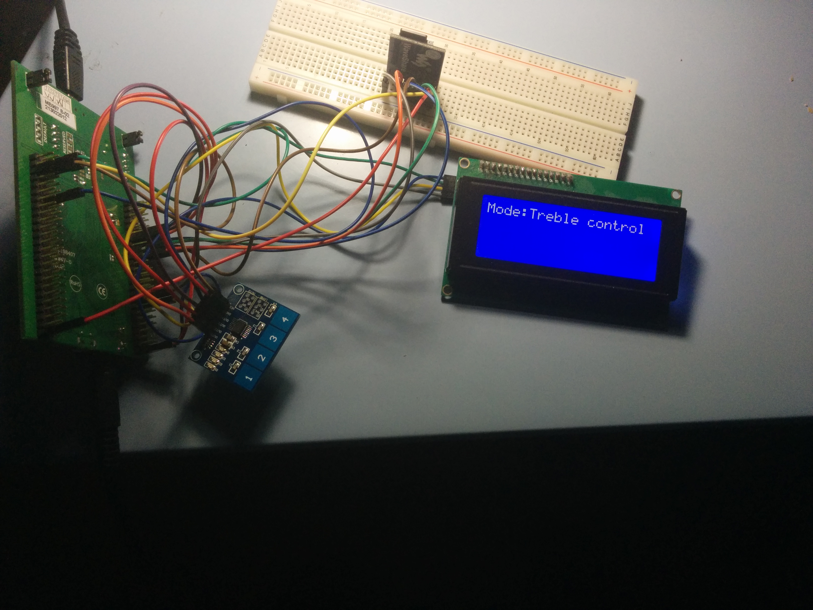
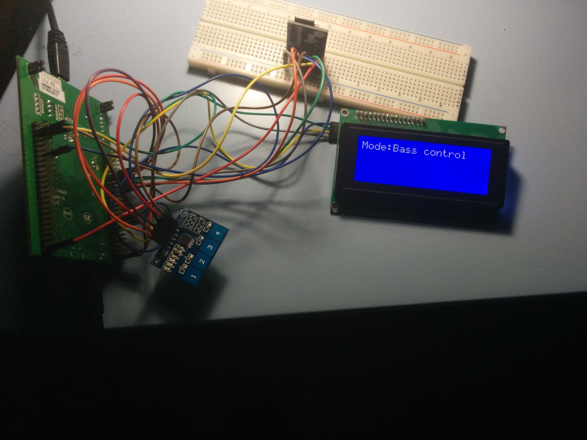

Audio player plays songs in .wav format. Player reads songs from an external microSD card. It has abilities such as:

- Volume control,
- treble and bass control,
- selecting next/previous song.

Here are the pictures of the player:

