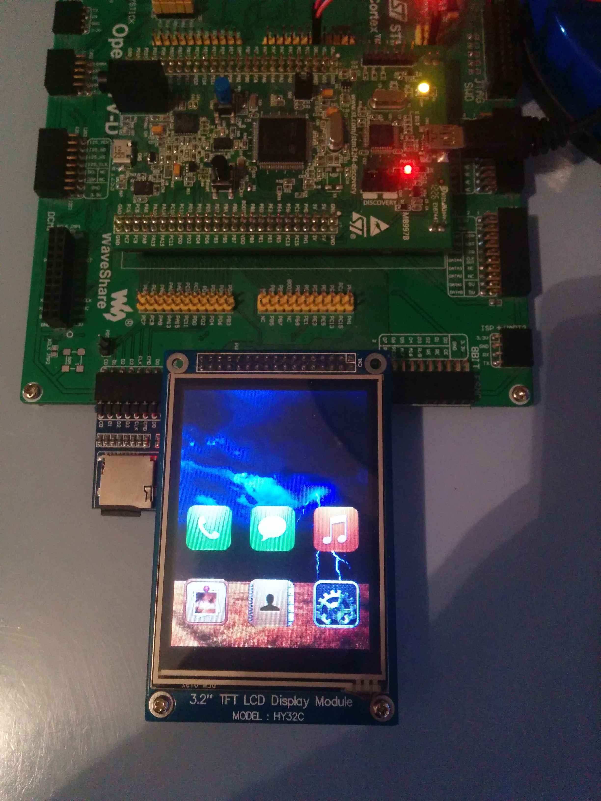
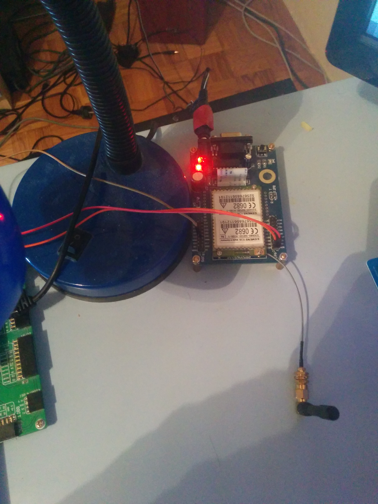
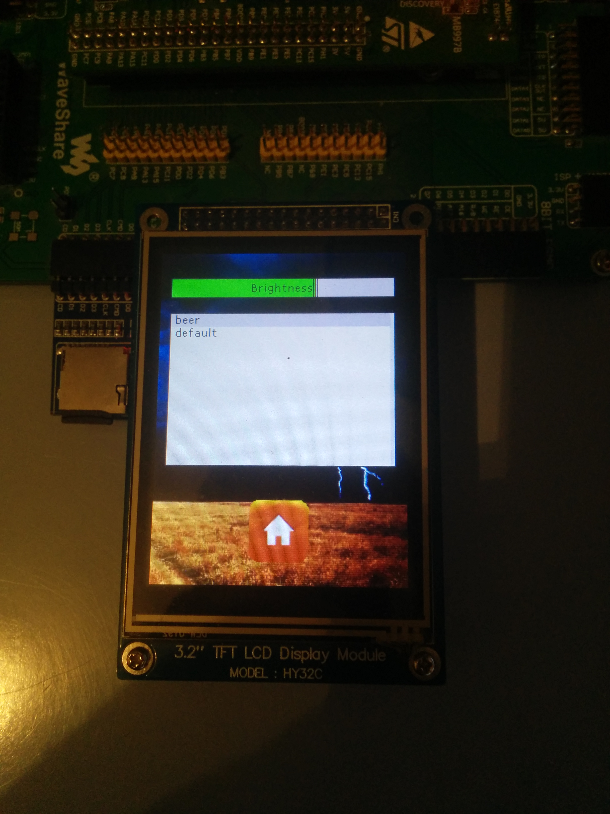
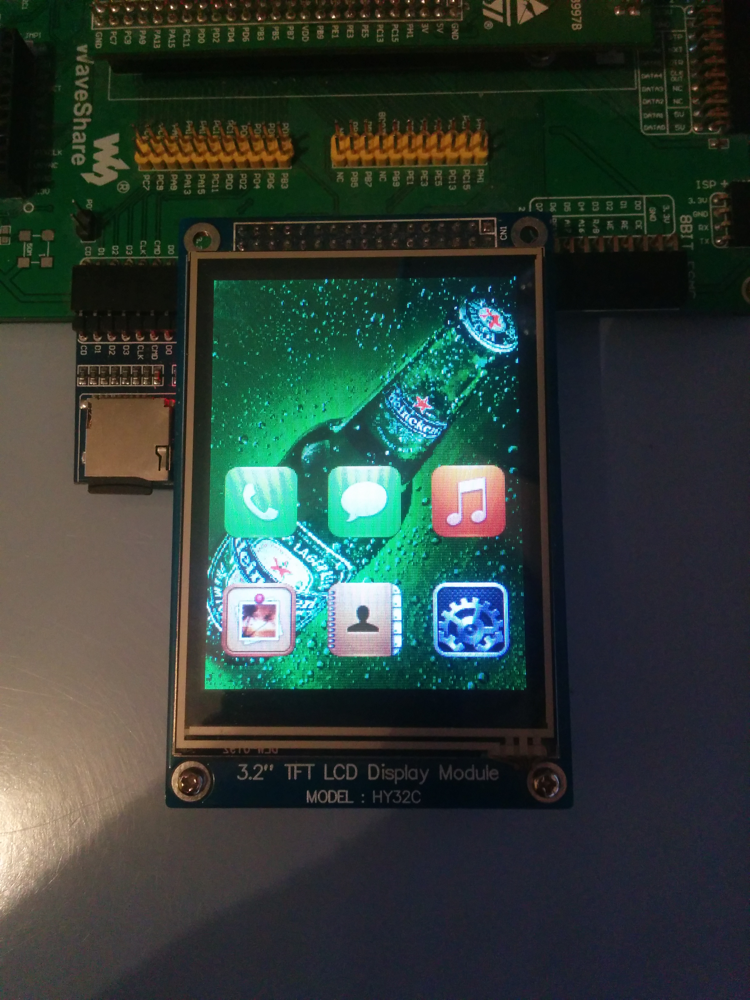
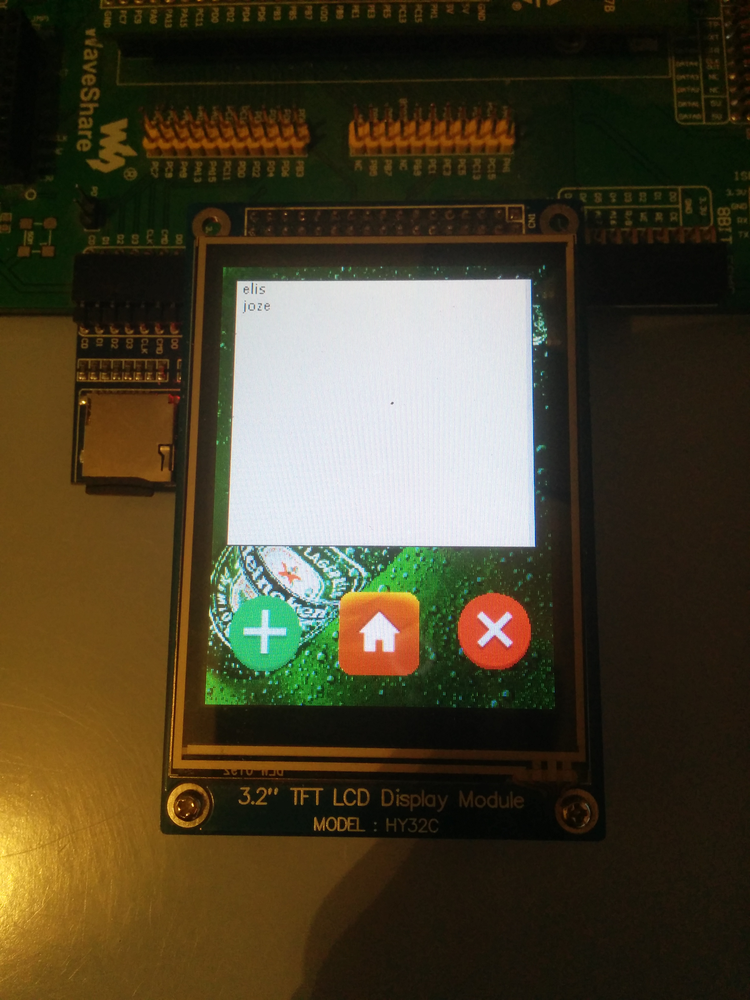

Mobile phone is comprised of various components such as GSM module, SD card module, LCD touch screen and a STM32f4 discovery development board.
There is a chibios RTOS running on a microcontroller and on the top of the chibios is a gui library named uGFX which can be downloaded from http://ugfx.org/ and is free.

Mobile phone has the following features implemented in v1.0:
- User can make and receive a call. Mobile phone also provides ability to show missed calls.
- User can watch pictures which are preloaded on the sd card.
- User can add and delete contacts. Mobile phone also provides ability to make a call from a contacts section.
- User can change brightness and theme in a settings section. Themes can be uploaded on the sd card.

All pictures can be found in a Picture folder. Here are few pictures of the components and user interface:

